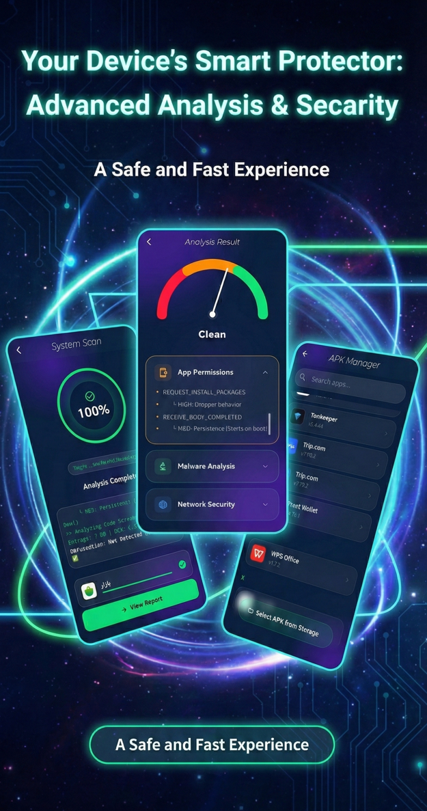
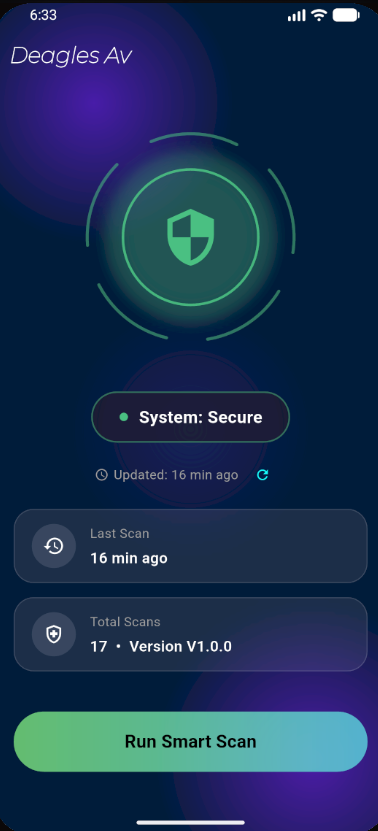

# 🦅 Deagles AV
## Advanced Hybrid Malware Analysis Suite

<p align="center">
  
  
</p>


Deagles AV is a modern Android malware analysis framework that combines static inspection, cloud-based intelligence, and AI-driven threat synthesis to bridge traditional signature-based detection with behavioral analysis.  
Future updates will focus on improving response quality, increasing detection accuracy, and enhancing partial offline analysis capabilities to ensure more reliable operation with reduced cloud dependency.

---

## 📂 Project Structure

```bash
lib/
├── controllers/
│   ├── analysis_controller.dart
│   ├── app_list_controller.dart
│   ├── home_controller.dart
│   └── result_controller.dart
│
├── data_models_services/
│   ├── apk_extractor.dart
│   ├── gemini_service.dart
│   └── vt.dart
│
├── pages/
│   ├── analysispage.dart
│   ├── app_list_page.dart
│   ├── home_binding.dart
│   ├── HomePage.dart
│   └── resultscreen.dart
│
├── utils/
│   ├── sha256.dart
│   ├── shaparak_guard.dart
│   └── VTextract.dart
│
├── widgets/
│   ├── ripple_effect.dart
│   └── security_core_widget.dart
│
└── main.dart
```
## 🧠 System Overview

Deagles AV analyzes Android applications using a hybrid security pipeline that integrates static analysis, cloud-based behavioral intelligence, and AI-powered verdict synthesis.
Planned improvements include refined heuristic scoring, faster response times, higher detection precision, and stronger offline static analysis for environments with limited connectivity.


## 🚀 Analysis Workflow

**Deconstruction**  
Extracts `AndroidManifest.xml` and DEX headers from the APK.

**Integrity Check**  
Generates a unique SHA-256 fingerprint and checks global malware databases.

**Static Audit**  
- Shaparak phishing and payment-gateway detection  
- DEX entropy analysis for packed or obfuscated code  

**Behavioral Query**  
Submits encrypted samples to VirusTotal sandbox environments.

**AI Synthesis**  
Gemini AI correlates all findings into a final **Threat Score** and technical summary.

---

## 🛠️ Tech Stack & Dependencies

| Library | Version | Purpose |
|------|--------|--------|
| get | ^4.7.3 | Reactive State Management & Navigation |
| google_generative_ai | ^0.4.7 | Gemini 1.5 Flash AI Engine |
| dio | ^5.9.0 | Async API Communication |
| file_picker | ^10.3.8 | Secure APK File Access |
| installed_apps | ^2.0.1 | Installed App Enumeration |
| shared_preferences | ^2.5.4 | Encrypted Persistent Storage |
| crypto | ^3.0.7 | SHA-256 Integrity Verification |

---

## 🖥️ Interface Preview

**Dashboard Overview**  
Reactor-core-inspired UI showing real-time device security posture.

**Real-Time Terminal Analysis**  
Live console-style logging of APK extraction, hashing, and cloud intelligence queries.

**AI Verdict Generation**  
Final threat assessment and technical summary generated by Gemini AI.

---

## ⚠️ Legal Disclaimer

This software is intended strictly for educational and authorized security research.  
Analyzing third-party applications must comply with applicable laws and permissions.